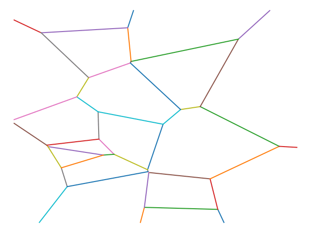

# RampantTrackGeneration is..

.. the Track generation logic for [Rampant on the Tracks](https://jpshh.com/rott/pitch).

The logic is invoked by calling 

```Python
@staticmethod
def generateTrack(
    diagramWidth: int,
    diagramHeight: int,
    numWalkersOnTrack: int,
    numDestinationsOnTrack: int,
    diagramEdgePercentageToProcess: float, 
    newConnectionAngleMinQuantile: float, 
    lonelyConnectionMinLengthQuantile: float, 
    connectionLengthVertexPadding: float, 
    connectionLengthNodeBuffer: float
) -> Track:
```

in `TrackGenerator`.

`Track`

```Python
@dataclass(frozen=True)
class Track:
    nodes: dict[uuid4, Point]
    stops: dict[uuid4, tuple[Point]]
    edges: dict[uuid4, EdgeVertexInfo]
```

describes a set of `edges`, each a connection between two `Point`s. `nodes` are the `Point`s - `stops` are intervals on each edge, a gameplay mechanic that'll be elaborated later.

`generateTrack` derives the `Track` from a randomly generated Voronoi diagram. 

It preserves the organic appeal of the diagram's shape - connectivity of varying lengths between unevenly spaced points - and goes on to enhance that by removing a subset of the smallest edges, replacing them with longer " reconnections ". The reconnections' intersections with other edges are calculated. Intersections that could be removed without newly isolating either of the involved `Point`s are removed - this, and further trimming, increase the variance of the resulting Track's shape and its appeal in both visual and gameplay terms.

It uses [Voronout](https://pypi.org/project/Voronout/) to generate the diagram and [networkX](https://pypi.org/project/networkx/) to model the diagram's transformation into a `Track`.

## RampantTrackGeneration works by..

.. doing the following:

* calculating `numRegions` (`numWalkersOnTrack * numDestinationsOnTrack * 2`)
* generating #`numRegions` Voronoi diagram sites (`0 <= x <= diagramWidth`, `0 <= y <= diagramHeight`)
* generating the Voronoi diagram
* using `newConnectionAngleMinQuantile` to calculate `initialDiagramMinAcceptableAngle`, the minimum angle any new reconnection should make with any of the edges at either of its vertices
  * rejecting any reconnection that does not satisfy that constraint minimizes the probability of getting `Track` edges that make awkwardly small angles with other edges
* reconnecting `diagramEdgePercentageToProcess * 100`% of the smallest edges in the diagram
* removing all intersection edges created by reconnection that can be safely removed
* removing all " lonely " edges (ones where one vertex is only connected to that edge) with length <= `lonelyConnectionMinLengthQuantile * 100`% of all edge lengths
* placing `Stops` on the remaining edges
  * to avoid the awkwardness of placing on " too small edges ", we only place on edges whose length is greater than `(connectionLengthVertexPadding + connectionLengthNodeBuffer) * 100`% of edges
  * to space `Stops` organically on an edge, we place them at least `connectionLengthVertexPadding * 100`% of the edge length away from either of points - and make the distance between each `Stop` at least `connectionLengthNodeBuffer * 100`% of the edge length

The resulting enhancement can be seen in the below illustration of `Voronoi diagram` -> `Track`:

