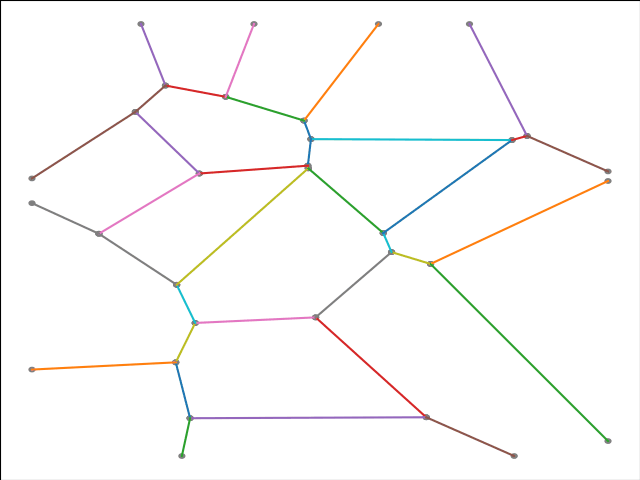

# RampantTrackGeneration is..

.. the Track generation logic for [Rampant on the Tracks](https://jpshh.com/rott/pitch).

The logic is invoked by calling 

```Python
@staticmethod
  def generateTrack(
      diagramWidth: int,
      diagramWidthOffset: float,
      diagramHeight: int,
      diagramHeightOffset: float,
      diagramNodeRadius: float,
      numDiagramRegions: int,
      diagramEdgePercentageToProcess: float, 
      newConnectionAngleMinQuantile: float, 
      lonelyConnectionMinLengthQuantile: float, 
      connectionLengthVertexPadding: float, 
      connectionLengthNodeBuffer: float,
      destinationDistanceUpperQuantile: float,
      maxFuelCost: float
  )
```

in `TrackGenerator`.

`Track`

```Python
@dataclass(frozen=True)
class Track:
    nodes: dict[uuid4, Point]
    edges: dict[uuid4, EdgeVertexInfo]

    startNodeId: uuid4
    destinationNodeId: uuid4
    
    nodeInfo: dict[uuid4, NodeInfo]
    edgeInfo: dict[uuid4, EdgeInfo]
```

describes a set of `edges`, each a connection between two `Point`s. `nodes` are the `Point`s.

`generateTrack` derives the `Track` from a randomly generated Voronoi diagram. 

It preserves the organic appeal of the diagram's shape - connectivity of varying lengths between unevenly spaced points - and goes on to enhance that by removing a subset of the smallest edges, replacing them with longer " reconnections ". The reconnections' intersections with other edges are calculated. Intersections that could be removed without newly isolating either of the involved `Point`s are removed - this, and further trimming, increase the variance of the resulting Track's shape and its appeal in both visual and gameplay terms.

It uses [Voronout](https://pypi.org/project/Voronout/) to generate the diagram and [networkX](https://pypi.org/project/networkx/) to model the diagram's transformation into a `Track`.

`startNode` and `destinationNode` reflect the gameplay - where the Walker the player is responsible for starts from, and where it must end up for the player to win.

`nodeInfo` maps nodes to further information about them

```Python
@dataclass(frozen=True)
class NodeInfo:
    distanceToDestination: float
    numNeighbors: int
```

that the game logic needs.

`edgeInfo` does the same for edges.

```Python
@dataclass(frozen=True)
class EdgeInfo:
    fuelCost: float
    edgeLengthProportion: float

    edgeStopInfo: tuple[StopInfo]

    edgeStopsFromVertex0: tuple[uuid4]
    edgeStopsFromVertex1: tuple[uuid4]
```

`edgeStopInfo` describes what " stops " are on the edge: 

```
@dataclass(frozen=True)
class StopInfo:
    stopPoint: Point
    stopId: uuid4

    fuelAvailable: float
```

`EdgeInfo.fuelCost` and `StopInfo.fuelAvailable` together make gameplay mechanics. When a Walker travels over an edge, its fuel is depleted by `fuelCost` - but that depletion can be offset by the sum of the `fuelAvailable` values in `EdgeInfo.edgeStopInfo`.

## RampantTrackGeneration works by..

.. doing the following:

* generating #`numDiagramRegions` Voronoi diagram sites (`0 <= x <= diagramWidth`, `0 <= y <= diagramHeight`)
* generating the Voronoi diagram
* offsetting the diagram with regards to frontend display constraints (`diagramWidthOffset`, `diagramHeightOffset`, `diagramNodeRadius`)
* using `newConnectionAngleMinQuantile` to calculate `initialDiagramMinAcceptableAngle`, the minimum angle any new reconnection should make with any of the edges at either of its vertices
  * rejecting any reconnection that does not satisfy that constraint minimizes the probability of getting `Track` edges that make awkwardly small angles with other edges
* reconnecting `diagramEdgePercentageToProcess * 100`% of the smallest edges in the diagram
* removing all intersection edges created by reconnection that can be safely removed
* removing all " lonely " edges (ones where one vertex is only connected to that edge) with length <= `lonelyConnectionMinLengthQuantile * 100`% of all edge lengths
* adjusting all edges with length < `minEdgeAdjustLength`, either..
  * .. combining them with another collinear edge such that the combination would make the longest edge possible 
  * .. deleting the edge, reconnecting all edges involving the vertex with the fewest neighbors to the other vertex
* adjusting all nodes too close to other edges or nodes (length between < `diagramNodeRadius * 2`)
  * Edges: Extending the segments to which the node is connected to intersect with the too-close edge (and deleting any intersection edges where length between < `minEdgeAdjust`)
  * Nodes: Taking each (node, otherNode) pair where one is too close to the other, picking the one with less neighbors, and reconnecting those neighbors to the other node to create longer edges.
* adjusting node positions so that they fall within frontend display constraints
* determining the remaining edges' fuel costs
  * the longest edge's cost is `maxFuelCost` - the other edges' costs are scaled in proportion to that
* placing `Stops` on the remaining edges
  * to avoid the awkwardness of placing on " too small edges ", we only place on edges whose length is greater than `(connectionLengthVertexPadding + connectionLengthNodeBuffer) * 100`% of edges
  * to space `Stops` organically on an edge, we place them at least `connectionLengthVertexPadding * 100`% of the edge length away from either of points - and make the distance between each `Stop` at least `connectionLengthNodeBuffer * 100`% of the edge length
  * each `Stop`'s `StopInfo.fuelAvailable` is calculated so that the sum of those values for a given edge's set of Stops is between 50-75% of the edge's `fuelCost`
* calculating `Track.startNode` and `Track.destinationNode`
  * `Point.distance(<startNode>, <destinationNode>)` must be >= `destinationDistanceUpperQuantile * 100`% of the distances non-`startNode`s have to `startNode`
* calculating `Track.nodeInfo`

The resulting enhancement can be seen in the below illustration of `Voronoi diagram` -> `Track`:

